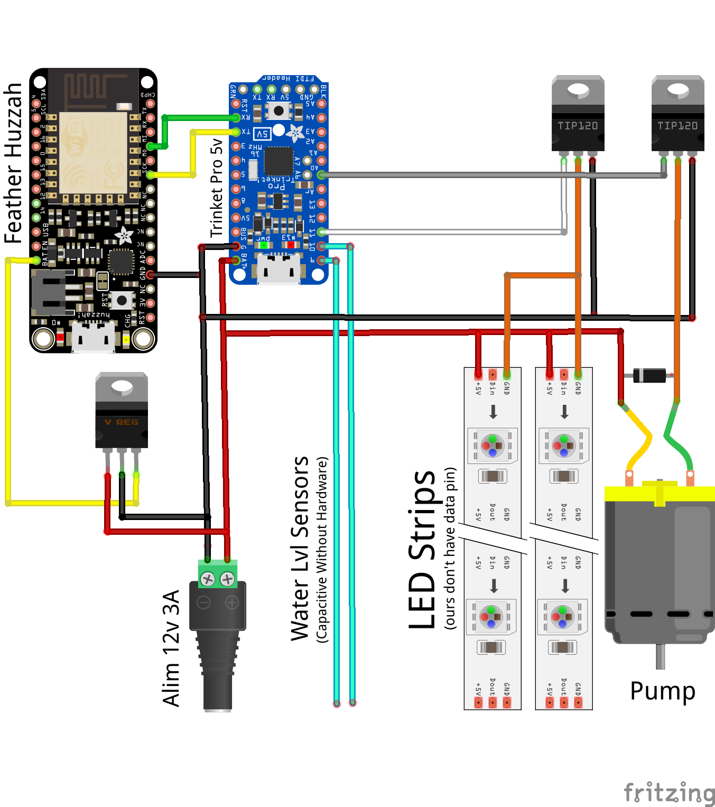

# makers'potow

### Software
Code is split between feather huzzah and trinket boards and you'll need to unlink RX/TX from both to upload code.
For Trinket, [SimpleTimer](https://playground.arduino.cc/Code/SimpleTimer#Download) library is required.  
Feather Huzzah's internet and adafruit.io connections have to be configured in `code_feather/config.h`.

### Circuit

